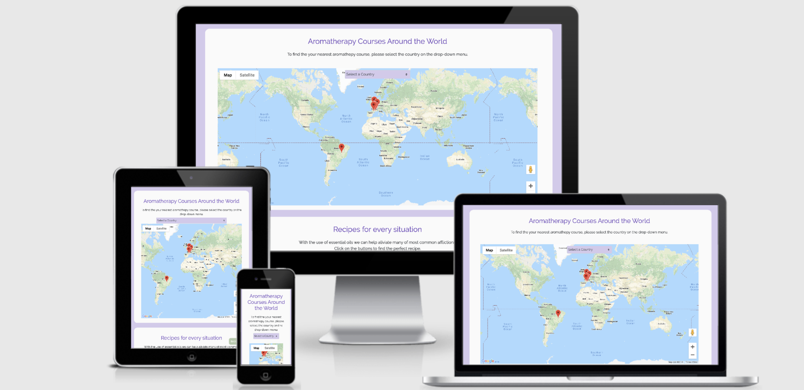
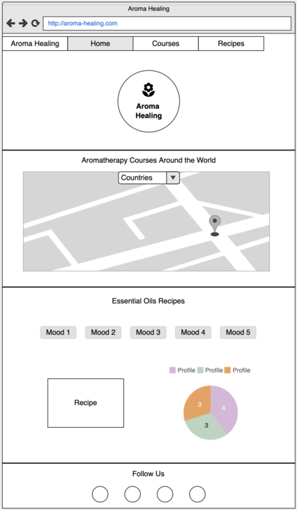

# Aroma Healing (Second Milestone Project | Code Institute)

## Introduction

This project is a website for people who are looking for an aromatherapy course around the world. With a clean, convenient and attractive layout, the website has a drop-down menu and a map where the user can navigate to find the best location for their course. The website has a bonus to provide some useful recipes to heal the most common affliction with the use of essential oils. The user will also find the aromatic profile for selected recipe.

## Wireframes

These wireframes were created at [Moqups](https://moqups.com/).

## UX

This website is intended for anyone who wants start an aromatherapy course and wants to find the closest school/ institute. The bonus recipes on the website have the purpose to show the power of essential oils for those who are very new to the concept of aromatherapy. 

### User Stories

1. Juliana

She is a young adult from Rio de Janeiro and just started yoga classes. On the classes her teacher uses a blend of essential oils on a diffuser that makes her very relaxed. Juliana wants to learn how to make more blends.

 
2. Clara

She is a busy professional living in the New York. She has frequent migraines and wants to reduce taking so much medicine every day. She has a friend that recommended the use of essential oils, but she never used them. She wants to learn how to cure her migraines with essential oils. 

3. Mauricio

He is 45 years old, living in London. He has always been passionate about oriental medicine and works as a acupuncturist. He wants to study aromatherapy and start using it with his patients.

4. Melinda

She is 35 years old and works as a Doula in Sydney. In her studies to become a doula she has studied some aromatherapy and really liked. She was able to see the real effects of the essential oils with her patients in labor. Now she wants to understand more about aromatherapy and find more uses within her patients. 

## Features

### Existing Features

**Navbar**
* Bootstrap code was used to make the navbar.

**Background Image and Logo**
* Shows a full width image of a lavender field and the Aroma Healing logo.

**Maps Drop-down Menu** 
* It shows all countries that have Aromatherapy courses listed on our map.

**The Map**
* It is an interactive map where the user can move it and click on the markers in order to see the information of selected school/ institute.

**Recipes Container**
* In this container the user will find information of the use of essential oils.

**Recipe Buttons**
* Each button shows recipes for the most common afflictions. By clicking on each button the user will see a recipe and the aromatic profile for each recipe.

**Recipe Container**
* This container has a text asking the user to click on the buttons above. When a button is selected a recipe will show on this container.

**Aromatic Profile Pie Chart**
* This pie chart will move accordingly to the selected button. It will show the aromatic profile for each recipe. There is a legend below the pie chart that will allow the user to understand the pie chart.

**Back to Top Button**
* This button shows once the user reaches The Map container. By clicking on this button the screen scroll to the top of the page.

**Footer**
* It contains links to social media pages that the user can click if they would like to follow the company on social media platforms.
 
### Features Left to Implement
* A online store where the user can buy essential oils.
* More recipes with video instructions.
* A essential oils online course where the user can learn the basics of aromatherapy.

## Technologies Used
The technologies used were:

[HTML](https://developer.mozilla.org/en-US/docs/Web/Guide/HTML/HTML5)

* Is the markup language used for rendering the website. 

[CSS](https://developer.mozilla.org/en-US/docs/Web/CSS/CSS3)

* Is the language used to style the HTML website.

[JavaScript](https://developer.mozilla.org/en-US/docs/Web/JavaScript)

* Is used for the responsive and interactive elements of this project.

[Bootstrap](https://getbootstrap.com/docs/4.4/getting-started/introduction/)

* Is the front-end framework used to assist in page layout, navigation and modal.

[D3.js](https://d3js.org)

* It was used to create a pie chart that shows the aromatic profile for each recipe.

[Flat Icon](https://www.flaticon.com/)

* Its icons were used on Maps Markers.

[Font Awesome](https://fontawesome.com/icons)

* Its icons were used on the Footer.

[Git](https://github.com/)

* Local git repository was pushed to remote repository on GitHub and site was published using GitHub pages.

[Google Fonts](https://fonts.google.com/)

* Its fonts were used on the website. Main theme font was "Raleway" and sub-theme font was "Sans-Serif".

[Google Maps](https://developers.google.com/maps/documentation/javascript/tutorial)

* This project uses the Google Maps API and associated code to generate a map with multiple markers.

[JQuery](https://jquery.com)

* Is used to simplify DOM manipulation when creating the markers on the map and to zoom on the map when a country is selected on the drop-down menu.

[Pexels](https://pexels.com/)

* The background image used on the website was downloaded from Pexels, a stock image library.

## Testing

* When implementing the markers clustering on the map the data wasn't loading. I was able to fix with the method found on [Stack Overflow](https://stackoverflow.com/questions/28606149/load-data-from-json-file-into-map-markers-in-google-maps).

* When "Aroma Healing" was clicked on navbar it was showing 404 error page. I fixed it changing href="/" for href="index.html".

* The navbar was not fixing to the top of the page when scrolling down. I found this was happening because Bootstrap class was overwriting "position: sticky;". I was able to fix it adding "!important" to position on nav.

* When clicking on any button on the recipe container it was scrolling to the top of the page. I fixed it adding preventDefault() event method to the buttons function.

* The website was tested throughout the building of the project using the dev tools within the browser.

* The HTML was checked on [HTML Validator](https://validator.w3.org/). 

* CSS3 was checked on [CSS3 Validator](https://jigsaw.w3.org/css-validator/)

* JavaScript was checked on [JS Hint Validator](https://jshint.com/)

* JSON was checked on [JSON Validator](https://jsonlint.com/)

* The responsiveness of this website was tested constantly during the development process. It was tested in real desktops, tablets and mobile devices as well as on Google Chrome developer tools.

* The website was tested on different browsers such as Google Chrome, Safari, Internet Explorer and Mozilla Firefox.

* I asked friends and family members to test the functionalities of the website on desktop and mobile devices. Their feedback was used to improve the website usability.

## Deployment

1. This project was developed using Visual Studio Code (VSC) and cloned to a Git Repository.

2. The project files were regularly pushed to my [GitHub repository](https://github.com/mariana-stefani/aroma-healing).

3. This website has been deployed using GitHub Pages and can be viewed [here](https://mariana-stefani.github.io/aroma-healing/).

### Run the Code Locally

1. Open the project [repository](https://github.com/mariana-stefani/aroma-healing).

2. Under the repository name, click "Clone or Download".

3. Follow [GitHub instructions](https://help.github.com/en/github/creating-cloning-and-archiving-repositories/cloning-a-repository) to clone a repository.

4. On the project file "index.html", please replace the Google Maps API key with your own key. (The key used on this project is restricted to my own use.)

## Credits

### Media

* The background image used in this website were obtained from [Pexels](https://pexels.com/).

* The logo was designed by me on [Canva](https://www.canva.com/).

* Responsiveness across devices image from [Am I Reponsive Design](http://ami.responsivedesign.is/).

* Icons used on maps markers are made by Pixel perfect and Smashicons from [Flat Icon](https://www.flaticon.com/).

## Acknowledgments

All my gratitude to my husband and family who always have supported me. 
A big thank you to my mentor Simen Daehlin. Thank you to Tim Nelson from Code Institute for your time and assistance.
Thank you to everyone from Code Institute!

